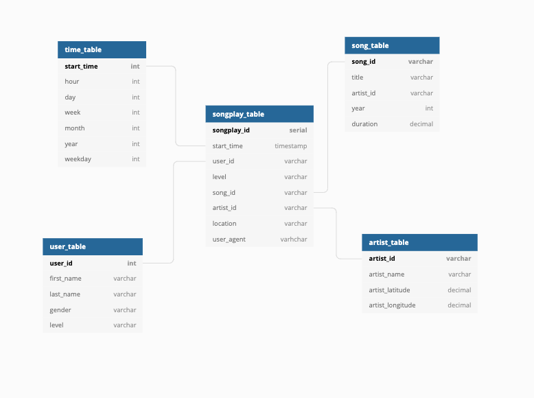

# postgres_data_modeling

## Overview
Design a Postgres database and ETL pipeline for analyzing song play, based on song data and user logs, for a music streaming startup Sparkify in Python and Postgres.

The data is stored in two directories as JSON which can be found nested in the
- `data/song_data` directory
  - this is a subset of the million song dataset
- `data/log_data` directory
  - from an event simulator

## Database Schema

The schema follows the star format with fact and dimension tables.

fact table
- songplay

dimension tables
- users
- artists
- time
- songs

## ETL pipeline

### to create an instance of the database

From the project directory in the terminal run

`$ python create_tables.py`

This script connects to a postgreSQL database to make a Sparkify database (or recreates it, if an instance already exists) and create the tables defined in the schema. It assumes there is a database `studentdb` to initially connect to.

**When the script is called**
-  connection to the studentdb database is made and a cursor is established
- if the sparkifydb database exists it is dropped
- a new sparkifydb database is made and a connection is established
- tables are dropped using the list of `drop_table_queries` in `sql_queries.py`
- new tables are created using the list of `create_table_queries` in `sql_queries.py`
- the connection to the sparkifydb database is closed

### to populate the database

`$ python etl.py`

This script loads the JSON data from `data/song_data` and `data/log_data` to populate the tables.

**When the script is called**
- a connection to the sparkifydb database is made and a cursor is established
- the process_data function is called for song data, which
    - finds json files in the `data/song_data` directory
    - iterates over all song files and calls the process_song_file function
        - the song json is read into a pandas dataframe
        - the song data is inserted to the song table using the `song_table_insert` function in `sql_queries.py`
        - the artist data is inserted to the artist table using the `artist_table_insert` function in `sql_queries.py`
        - commits the transaction to the sparkifydb database
- the process_data function is called for log data, which
    - finds json files in the `data/log_data` directory
    - iterates over all log files and calls the process_log_file function
        - the log json is read into a pandas dataframe
        - the log actions are processed to only include NextSong action
        - the timestamp is converted to a datetime
        - the time data is inserted to the time table using the `time_table_insert` function in `sql_queries.py`
        - the user data is inserted to the user table using the `user_table_insert` function in `sql_queries.py`
        - the songplays data is inserted to the songplays table using the `songplays_table_insert` function in `sql_queries.py`
            - this insert uses another query to get songid and artistid from song and artist tables
        - commits the transaction to the sparkifydb database
- the connection to the sparkifydb database is closed

### Other files
`sql_queries.py` holds all of the sql code for dropping, creating, and insert data into the Postgres database

the jupyter notebooks are for validating and tesing the ETL pipeline
- `etl.ipynb`
- `test.ipynb`
