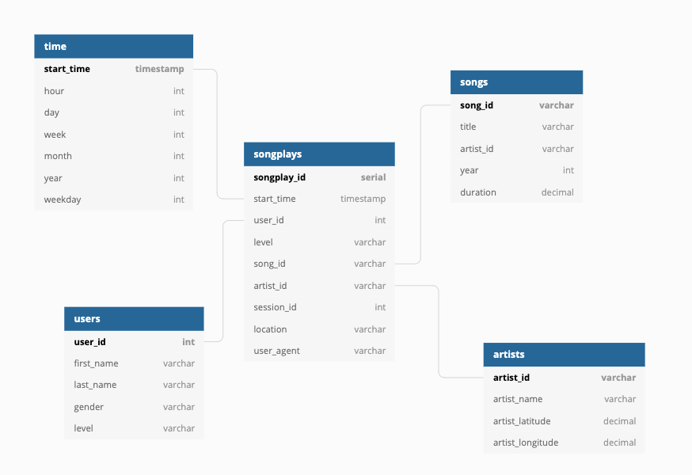

# postgres_data_modeling

## Overview
Create a pipeline for processing streaming song and user data using postgreSQL for a music streaming company Sparkify.

## Database Schema

The schema follows the star format with songplay being the fact table and 4 dimension tables (users, artists, time, songs)

## running the scripts

requirements?

`python create_tables.py`

this script connects to a postgreSQL database to make a Sparkify database and create the tables defined in the schema. It assumes there is a database `studentdb` to initially connect to.

to populate the database run
`python etl.py`

this script loads the JSON data from 'data/song_data' and 'data/log_data' to populate the tables.
